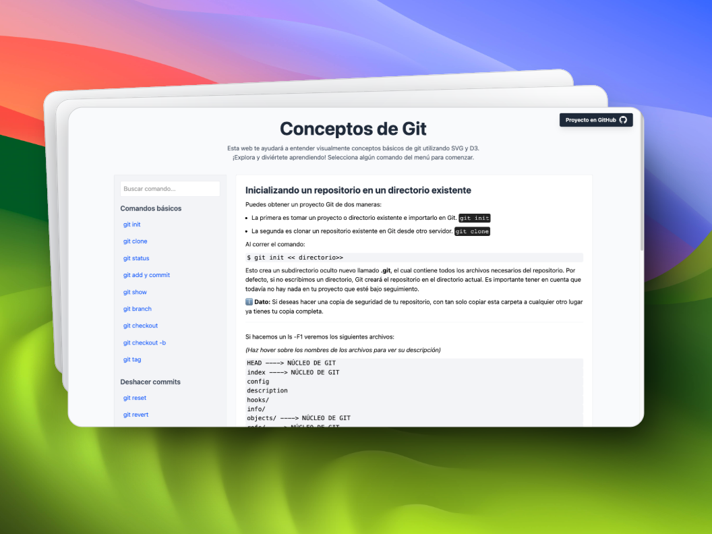

# 📚 Conceptos de Git con D3

Este proyecto tiene como finalidad ayudar a desarrolladores y estudiantes que están comenzando a adentrarse en el mundo del desarrollo o que ya poseen cierta experiencia. Conocer cómo funcionan los comandos de Git es fundamental para gestionar las versiones de nuestros proyectos. Git es una herramienta clave para el versionado de código en sistemas distribuidos. Aunque no se abordan los temas en profundidad, los invito a continuar investigando por su cuenta en la bibliografía utilizada a continuación. Es crucial comprender cómo funcionan las herramientas que utilizamos a diario para ser más eficientes y hacer uso de las buenas prácticas.

## 🔧 Instalación

El proyecto en sí no precisa de ninguna instalación, para poder levantarlo se puede utilizar la extensión [**Live Server**](https://marketplace.visualstudio.com/items?itemName=ritwickdey.LiveServer) en Visual Studio Code.

## 🤝 Cómo contribuir

1. Haz un fork del proyecto 
2. Crea una rama para tu feature, por ejemplo: (`git checkout -b feature/AmazingFeature`)
3. Haz commit de tus cambios, por ejemplo: (`git commit -m 'Add: AmazingFeature'`)
4. Haz push hacia la rama, por ejemplo (`git push origin feature/AmazingFeature`)
5. Abre una pull request detallando los cambios desarrollados.

## 📋 Estándares de código

### Commits

En la medida de lo posible, describe tus commits para que los colaboradores los puedan analizar de una forma más rápida y eficiente.

- `feat:` - Nuevas características.
- `fix:` - Correcciones de bugs.
- `docs:` - Cambios en la documentación.
- `style:` - Cambios que no afectan el código (espacios, formato, etcétera).
- `refactor:` - Refactorización del código.
- `test:` - Añadir o modificar tests.
- `chore:` - Cambios en el proceso de build o herramientas auxiliares.

Ejemplo: `feat: add newsletter subscription component`

### Pull requests

- Describe claramente los cambios realizados.
- Incluye capturas de pantalla si hay cambios visuales.
- Referencia los issues relacionados, en caso de que existan.
- Mantén los PR pequeños y enfocados en una sola característica.

## Biblografía consultada
- [Libro Pro Git 2da edición - 2014](https://git-scm.com/book/en/v2)
- [Guía de Bitbucket sobre el uso de Git](https://www.atlassian.com/git/tutorials/learn-git-with-bitbucket-cloud)
- [A successful Git branching model - GitFlow](https://nvie.com/posts/a-successful-git-branching-model/)
- [Writing a Good Git Commit Message - GitKraken](https://www.gitkraken.com/learn/git/best-practices/git-commit-message)
- [Version Control (Git)](https://missing.csail.mit.edu/2020/version-control/)

## Información adicional
Este proyecto es un fork del siguiente [repositorio](https://github.com/onlywei/explain-git-with-d3). (autoría de [Wei Wang](https://github.com/onlywei)) 

## Colaboradores

(Pendiente...)
